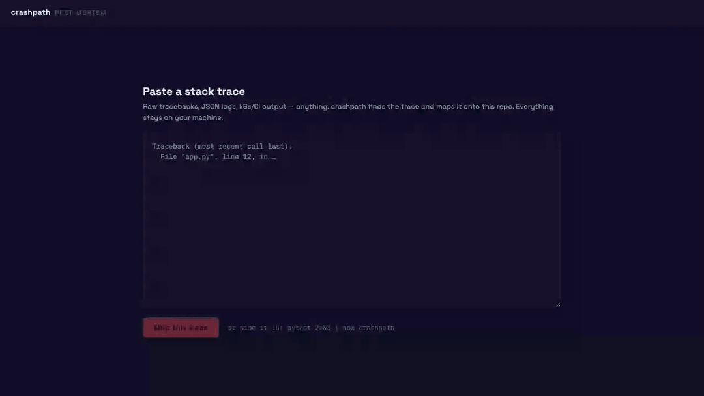
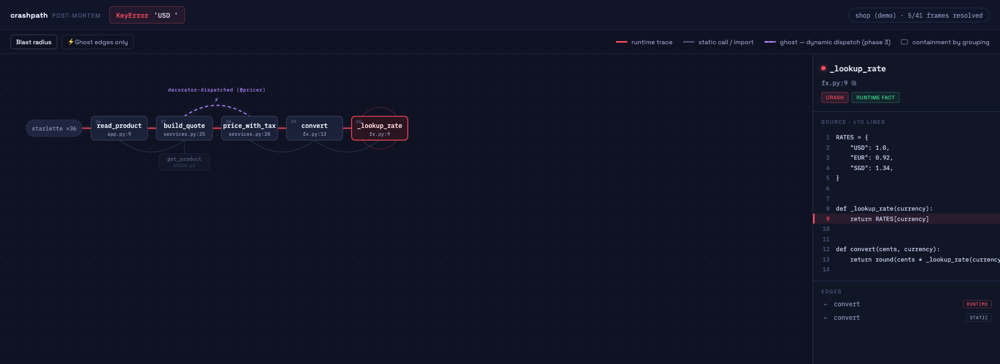

# crashpath

**Paste a raw stack trace → see the failure as a path through your codebase graph.**
Post-mortem, local-first, zero setup. No debugger session, no Docker, no API key, works offline.


<!-- GIF recorded at launch; storyboard in docs/phase3-notes.md. Flagship still: -->


```console
$ cd my-repo
$ npx crashpath              # paste a traceback into the browser
$ pytest 2>&1 | npx crashpath   # or pipe it straight in
$ npx crashpath demo            # zero-config demo, right now
```

## What you get

A stack trace is a **principled filter** over your codebase — it selects the ~10 functions that
matter *right now*. crashpath parses only the files the trace touches, builds a ground-truth graph
with tree-sitter, and overlays the runtime failure path:

- ▬ **red** — the runtime trace: what actually executed. Exact, always.
- ▬ **grey** — static call/import edges parsed by tree-sitter. Best-effort, honestly labeled.
- ⤳ **violet, dashed** — **ghost edges**: runtime hops with *no* static edge. That's not a bug —
  that's your decorator/registry/framework dispatch made visible, labeled with the mechanism.
- Blast radius: 1-hop callers (via `git grep`) and callees around the failure path.
- Click any node → the source, crash line highlighted. `←`/`→` walks the spine.

Also: multi-trace picker for messy logs · sourcemap resolution for minified JS
(`dist/bundle.js:1:4823` → `src/pricing.ts:19`) · chained exceptions as stacked spines ·
`--ref v1.4.2` to analyze the exact version that crashed (git worktree) ·
`crashpath export -t trace.txt -o failure.html` for a self-contained artifact you can attach to an issue.

## Why another code visualizer?

| Documented pain elsewhere | crashpath's answer |
|---|---|
| Large repos break whole-repo indexers (timeouts, context limits) | Trace-as-filter: parse only trace-reachable files — typically <50, even in monorepos |
| AI-generated diagrams aren't ground truth | Three layers, visually distinct: runtime fact / parsed evidence / badged inference. AI can never draw nodes or edges |
| Mermaid rendering ceiling | Custom SVG renderer, deterministic layout, full interactivity |
| Setup friction: Docker, keys, DBs | `npx crashpath`. Nothing else. Fully offline core |
| Per-language native indexers killed Sourcetrail | tree-sitter WASM grammars + ~200-line frame parsers; [add a language](docs/adding-a-language.md) |
| Static analysis can't see runtime dispatch | Ghost edges — the trace *is* runtime truth |
| Line numbers drift between prod and HEAD | `--ref` checks out the crashed version in a throwaway worktree |

## Languages

Python and JavaScript/TypeScript (including sourcemaps) in v1 — done well, on a 32-fixture
corpus of real, ugly traces (k8s/JSON/CI log wrapping, chained exceptions, pytest formats,
minified stacks). Frame-parse rate: 32/32. More languages via the
[plugin interface](docs/adding-a-language.md).

## Optional AI (bring your own key — or no key at all)

```console
$ crashpath --ai ollama --model qwen3:4b     # fully local, no key
$ ANTHROPIC_API_KEY=… crashpath --ai anthropic
$ OPENAI_API_KEY=… crashpath --ai openai
```

The payload is ~3–5k tokens (frames + snippets), small enough for a local 3B model. Output is a
schema-validated annotation — root-cause hypothesis, ghost-edge explanations, suggested fix —
rendered in a clearly-badged "AI inference" panel. **AI never draws graph structure.**

## MCP (for agents)

```console
$ claude mcp add crashpath -- npx crashpath mcp
```

Tools: `map_trace(trace_text, repo_path?, ref?)` → structured failure summary + a local UI URL for
the human; `export_trace_map(trace_text, format)` → standalone artifact path.

## Privacy

The server binds `127.0.0.1` only. Source reads are sandboxed to the repo root. Zero network
calls unless you explicitly pass `--ai` (and with `--ai ollama`, still none beyond localhost).

## Honest limitations

- Static edges are name-resolution, not type inference — deliberately (that treadmill killed
  better-funded tools). Ambiguity is skipped, not guessed; ghost edges mark what static analysis
  can't see.
- Post-mortem only: no live debugger integration in v1.
- Two languages in v1. Ruby/Go/JVM/… belong to [contributors](docs/adding-a-language.md).
- pytest's default (non-native) traceback format is parsed to the failing test frame only.

## Development

```console
$ npm ci && npm --prefix ui ci
$ npm test          # vitest, incl. the 32-fixture corpus gate
$ npm run corpus    # parse-rate table
$ npx playwright test
```

Architecture notes: [docs/architecture.md](docs/architecture.md). Fixture corpus rules:
[CLAUDE.md](CLAUDE.md) — goldens are evidence, never regenerate silently.

MIT © Zhao Han Qing
