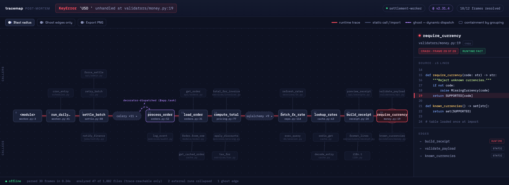

# Phase 0 report — validation spike

**Date:** 2026-07-11 · **Verdict: all three gates passed. Recommend proceeding to Phase 1.**

| Gate (plan §7) | Bar | Result |
|---|---|---|
| Frame-level parse rate on corpus | ≥90% (kill <75%) | **31/32 fixtures (96.9%)** — frame-level 271/271 (100%) on goldened fixtures |
| Tree-sitter symbol resolution, 3 real repos | ≥80% (rescope <60%) | **200/200 in-repo frames (100%)** |
| Spine-layout mock, 12 frames + 20 radius nodes | legible, screenshot-worthy | **Pass** — see screenshot below |

---

## 0. Name check (§10)

- **npm `tracemap`: FREE** (404 in registry). `crashpath` also free; `stackscope` and `faultline` are taken.
- GitHub **org** `tracemap` is taken by a dormant Twitter-visualization project (tracemap-tool/tracemap-backend, Angular, last touched ~2018). The repo would live under your own account, so this only blocks the vanity org name. A handful of small `tracemap`-named repos exist (traceroute visualizers — different domain, ≤34 stars).
- **Decision needed from you** before Phase 1 scaffolding: keep `tracemap` (npm is the critical surface for `npx`) or switch to `crashpath` (fully free everywhere). No trademark hits found for either.

## 1. Corpus (Appendix B) — 32 fixtures in `fixtures/traces/`

20 Python + 12 JS/TS. Breadth: chained exceptions (cause/context), RecursionError with `[Previous line repeated]`, SyntaxError via import, ExceptionGroup, asyncio, Python 3.13 `~~~^^^` anchors, multiline messages, `<frozen importlib._bootstrap>`, Django/Flask/FastAPI/SQLAlchemy/requests/pytest/uvicorn (Python); CJS/ESM/async/`[cause]`/express/vitest/minified+sourcemap pair (JS); JSON-wrapped, k8s CRI-prefixed, winston-JSON, NestJS-prefixed, Azure-prefixed dirty logs; 4 traces from public GitHub issues (celery#7324, DRF#5236, nestjs#16469, next.js#57322).

**Golden provenance (circularity control):**
- 24 fixtures: goldens derived from the **runtime itself**, not from text parsing — Python `traceback.TracebackException` via an excepthook; V8 structured `CallSite`s via a preloaded `Error.prepareStackTrace` in a second run of the same deterministic program. Zero circularity.
- 4 fixtures (29–32): hand-transcribed from the public-issue text.
- 4 fixtures (16, 18, 26 + known-gap 17): framework-owned formats (pytest, uvicorn logs, vitest); goldens are parser-derived then human-audited (frame counts + first/last frames verified against raw text). Flagged `goldenOrigin` in each file.

Sanitization: usernames/machine paths rewritten to `/home/dev/app` etc., byte-structure preserved; verified zero leaks.

## 2. Gate 1 — parse rate (spike/parse.mjs + spike/corpus.mjs)

`node spike/corpus.mjs` → **31/32 trace-level (96.9%); 271/271 frames (100%) on the 31 goldened fixtures.**

The single failure is deliberate: `17-py-pytest-default` — pytest's default long format contains no standard traceback anchor at all (`path:line: in func` + `E` markers). Kept in the corpus as a Phase 1/2 extraction TODO (add a pytest-format anchor); `--tb=native` output (fixture 16) parses fully.

**Real-world formats the corpus forced us to handle** (none were in the original spec §5.1/5.2 — this is why corpus-first was the right call):
- **Node cause-elision**: `... 2 lines matching cause stack trace ...` — Node ≥16 elides outer frames that match the cause's tail; the spike parser reconstructs them from the cause block.
- Trailing ` {` on the last at-line when Node inspects an error object with properties.
- NestJS log prefix (`[Nest] 42467  - … ERROR [ExceptionHandler] TypeError: …` — header embedded in the prefixed line).
- Azure App Service per-line `<iso-ts>: [ERROR]` prefixes with interleaved partial stacks and a glued log path after the final frame.
- k8s CRI `<ts> stderr F ` prefixes; JSON log lines with `\n`-escaped traces in `exc_info` / `stack` fields.
- vitest's `❯` frame marker with repo-relative paths; pytest `--tb=native` includes ~17 pytest-internal frames (external-chip collapsing will matter for test traces).
- SyntaxError's `File "…", line N` block is a *location*, not a call frame (runtime golden proved it).

## 3. Gate 2 — symbol resolution (spike/resolve.mjs, web-tree-sitter 0.20.8 + tree-sitter-wasms)

Method: parse each trace, keep frames whose path resolves inside the repo, find the **innermost function-like tree-sitter node whose span contains the frame line**, and verify the runtime-printed symbol matches the node name (exact / last dotted segment; anonymous frames resolve by span; `<module>` resolves to file).

| Repo | Trace source | In-repo frames | Resolved |
|---|---|---|---|
| pallets/flask (clone @ HEAD) | 3 real tracebacks through flask internals (dispatch, templating, before_request) | 23 | 23 (100%) |
| express 5 (+ router, registry sources) | 2 real stacks (route handler TypeError, middleware error) | 17 | 17 (100%) — incl. `Layer.handleRequest`→`handleRequest`, 2 anonymous arrows by span |
| media-compression-backend (Han Qing's, working copy) | 1 real traceback (TestClient + DB-path fault injection) | 3 | 3 (100%) |
| media-compression-backend — AST differential | synthetic frames at real body lines, ground truth = Python `ast` | 157 | 157 (100%) |
| **Total** | | **200** | **200 (100%)** |

Notes: the express git clone was not used because installing its dev deps runs untrusted lifecycle scripts (denied by policy); the registry-published sources are the same code. Caveats worth carrying into Phase 1: line-drift between prod traces and HEAD (the `--ref`/badge case) is *not* exercised here; V8 `[as alias]` symbols and Python `<locals>` qualnames are handled by normalization but thinly represented in the sample.

## 4. Gate 3 — layout mock (spike/mock/spine.html)

12 spine columns (10 function nodes + 2 collapsed external chips: `celery ×11`, `sqlalchemy ×9`), 20 blast-radius nodes (8 callers above, 12 callees below, second rows stacked nearest-first), one labeled ghost edge (`⚡ decorator-dispatched (@app.task)`), always-visible legend, crash node with pulse, side panel with ±5-line snippet and highlighted crash line, trace-path draw-on animation (1.2s, `prefers-reduced-motion` respected).

Design direction ("oscilloscope/PCB board"): dot-grid midnight-indigo canvas, red hot-path with glow, violet dashed ghosts, mono type for everything that is evidence (trace/code), grotesk for chrome. This mock doubles as the Phase 3 visual north star and the GIF storyboard.

## 5. Spike code inventory (all throwaway, `spike/`)

- `spike/parse.mjs` — extraction (§5.1) + Python/V8 parsers (§5.2), ~430 lines.
- `spike/corpus.mjs` — golden-comparison harness; prints the gate table (`npm run corpus` equivalent for Phase 1).
- `spike/resolve.mjs` — tree-sitter resolution + metrics.
- `spike/gen/` — corpus + resolution trace generators (runtime-golden hooks, fault-injection scenarios, AST differential sampler).
- `spike/mock/spine.html` — static layout mock.

## 6. Recommendations for Phase 1

1. **Name**: decide `tracemap` vs `crashpath` (npm both free; GH org only matters for vanity).
2. Keep the runtime-golden generation technique — it becomes the fixture-refresh script in CI.
3. Promote the elision-reconstruction and prefix-stripping table into the real extractor with unit tests per pattern.
4. Add pytest-default-format extraction (fixture 17 flips the corpus to 32/32).
5. Resolution held at 100% on clean checkouts; build the §5.5 badges (`line/name mismatch`, `ambiguous path`) early because line-drift is the untested risk, not name matching.
