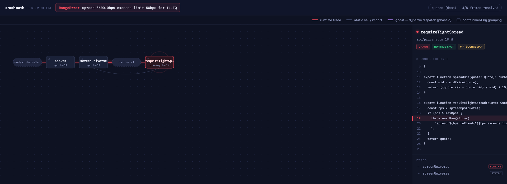

# Phase 2 notes — JS/TS + hardening

**Date:** 2026-07-11 · **§7 acceptance: both bars met.**

| Acceptance (§7 Phase 2) | Result |
|---|---|
| `demo node` incl. a sourcemapped frame | ✅ minified `dist/bundle.js:1:<col>` frames rewrite to `src/app.ts` / `src/pricing.ts`, crash badged `via-sourcemap` (tests/demo.test.ts + e2e) |
| JS corpus ≥ 90% | ✅ corpus is now **32/32 (100%)** — pytest-default (fixture 17) was the last gap and is closed |

## What shipped

- **pytest default-format extraction** — new anchor (test-name divider + `E` lines + `path:line: Type` location); `--tb=native` sections still route to the standard parser. Corpus 32/32.
- **JS/TS tree-sitter analysis** (`src/analyze/javascript.ts`) — declarations, class methods, bound arrows/function expressions, object-literal methods, imports (ESM named/default/namespace + `require()`), name-level call sites. Grammars vendored: javascript, typescript, tsx.
- **JS frame resolution** — grammar dispatch by extension; symbol normalization (`async` / `new` prefixes, `[as alias]`, dotted last-segment); anonymous frames resolve to the innermost named function by span (no badge — nothing to verify a name against).
- **Sourcemap stage (§5.3)** (`src/sourcemap/index.ts`) — runs between parse and resolve; inline data-URL, adjacent `.map`, and `sourceMappingURL` maps; broken/missing map → `no-sourcemap` badge, pipeline never fails. The map's `name` field is deliberately ignored (it's the identifier at the position, e.g. the thrown constructor — not the enclosing function); span resolution against the original source is exact.
- **Generated-files index** — `dist/build/.next/out` are excluded from the main repo index (and usually gitignored), but §5.3 must find bundles to read their maps; a dedicated bounded walk indexes them.
- **`crashpath demo node`** — bundled minified TS quotes app + pre-recorded real crash; the §5.3 story in one command.
- **Multi-trace picker (§5.1.4)** — `listTraces()` dedupes by exception signature with ×N counts; `POST /api/trace` returns a picker payload for multi-trace blobs; UI picker screen; `pick` re-post builds the chosen graph.
- **tsconfig paths (§5.4, best-effort)** — JSONC-tolerant loader, `@app/*`-style alias expansion in call-edge import matching. Same change made import matching language-aware, fixing JS relative imports (`./pricing`) never producing call edges.

## Corpus / gates status

- Trace-level parse: **32/32 (100%)**, frame-level 100% on goldens (`npm run corpus`).
- Python demo unchanged: 5/5 in-repo frames resolved. Node demo: crash + callers resolve into original TS via sourcemap.
- 98 vitest tests + 2 Playwright e2e; lint/typecheck/build clean.

## Known limitations (honest, carried forward)

- Python relative imports (`from .store import x`) don't produce call edges yet (absolute/flat imports do). Ghost-edge work in Phase 3 will revisit §5.6 edges anyway.
- Sourcemap symbol names are dropped rather than guessed; node names come from span resolution in the original source.
- `webpack://` and `eval at …` frames remain external-unresolvable chips (per §5.2).
