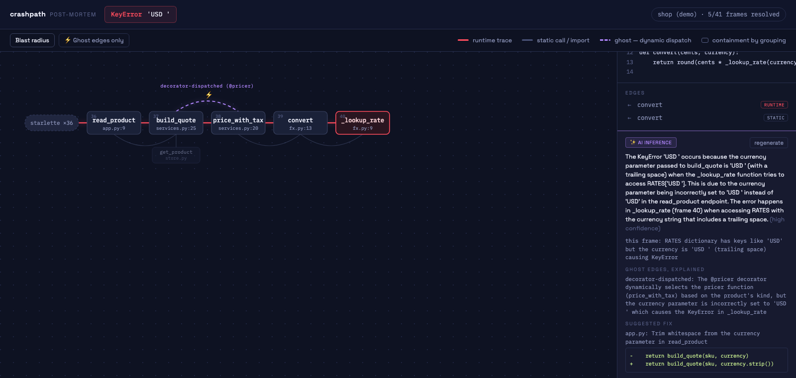

# Phase 4 notes — AI + MCP + docs · **FEATURE FREEZE**

**Date:** 2026-07-11 · **§7 acceptance: both bars met. v1 feature set is frozen.**

| Acceptance (§7 Phase 4) | Result |
|---|---|
| Ollama path works with a small local model | ✅ `tests/ollama-live.test.ts` against a real local daemon: 3/3 schema-valid runs with qwen3:4b (~17–20s); panel screenshot below is that model's real output |
| `claude mcp add` flow verified | ✅ the stdio server is exercised end-to-end by the official MCP SDK client (`tests/mcp.test.ts`): tools/list, map_trace (summary + live URL), export_trace_map, typed errors. The exact user command (`claude mcp add crashpath -- npx crashpath mcp`) is documented in README |

The screenshot is unedited local-model output: correct trailing-space root cause citing frame 40
(high confidence), the `@pricer` ghost edge explained, and a correct one-line diff
(`currency.strip()`). ~3.5k-token payload — §3.4's "small enough for a local 3B model" claim, proven.

## What shipped

- **AI layer (§3.4 / Appendix A)** — `src/ai/`: zod schema (deliberately no node/edge fields — G3
  by construction), ±5-line-snippet prompt builder, direct-fetch providers
  (Anthropic / OpenAI / Ollama with `format:"json"` + `think:false` for thinking-mode models),
  one repair retry, typed degradation → dismissible toast. `--ai <provider>` / `--model <name>`;
  keys via env. `POST /api/ai`, `GET /api/config`; badged "✨ AI inference" panel with
  regenerate, per-frame notes, ghost explanations, suggested fix + diff.
- **MCP server (§3.5)** — `crashpath mcp`: `map_trace` (structured summary + reused local UI
  server URL) and `export_trace_map` (standalone artifact path). stdout stays pure JSON-RPC.
- **Docs** — README (quickstart, why-table, epistemology, honest limitations, AI + MCP setup),
  LICENSE (MIT), SECURITY.md, docs/architecture.md, docs/adding-a-language.md.

## Feature freeze

Per §7, the v1 feature set is frozen as of this phase. Remaining work is the **launch weekend**
(§8): record the GIF, pre-file good-first-issues, CONTRIBUTING, publish 0.1.0 over the npm
placeholder, Show HN + newsletters + MCP directories. Post-freeze code changes: critical bugfixes only.

## Test totals

131 vitest tests (+1 live-Ollama, skipped on CI) + 3 Playwright e2e; corpus 32/32;
lint/typecheck/build clean.
